<p align="center">
  <picture>
    <source media="(prefers-color-scheme: dark)" srcset="assets/showcase/hero-home.png">
    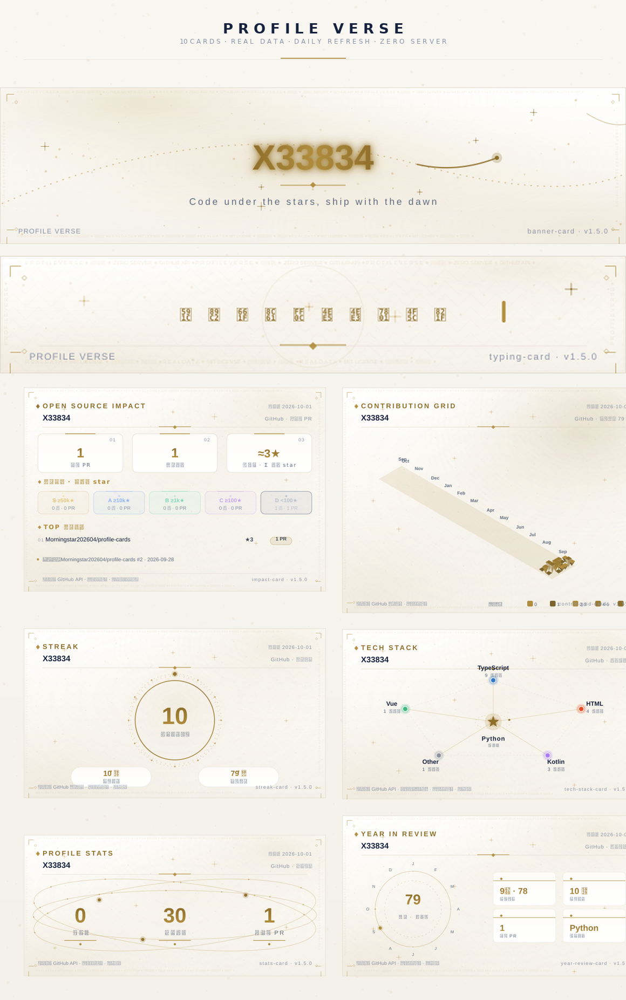
  </picture>
</p>

<h1 align="center">Profile Verse · Open-Source GitHub Profile Cards</h1>

<p align="center"><sub><b>Profile Verse</b> is the brand &middot; this repo is <code>profile-cards</code> &mdash; same project, one family.</sub></p>

<div align="center">

[English](README.md) &middot; [中文](README.zh.md) &middot; [日本語](README.ja.md) &middot; [Deutsch](README.de.md) &middot; [Español](README.es.md) &middot; [Français](README.fr.md) &middot; [한국어](README.ko.md)

</div>

<p align="center">
  <a href="https://github.com/X33834/profile-cards/stargazers"></a>
  <a href="https://github.com/X33834/profile-cards/forks"></a>
  <a href="https://github.com/X33834/profile-cards/actions"></a>
  <a href="LICENSE"></a>
  <a href="https://github.com/X33834/profile-cards/releases"></a>
  
</p>

> ⭐ **Like this project? Give it a star** — one click, and the cards stay free forever.

**Profile Verse** turns a plain GitHub profile into a **starry, data-driven showcase**: 10 open-source **SVG cards** — typing header, stats, streak, 3D contribution grid, tech stack, golden badges, projects, open-source impact, year-in-review, banner — generated for free by **GitHub Actions**, refreshed **daily** with **real GitHub API data**, in **7 color themes** with dark & light modes. One workflow file, copy & paste, zero servers, zero cost. [Live demo](https://github.com/X33834/X33834) — the cards are running on a real homepage today.

## 📑 Contents

- [✨ Features](#features)
- [✨ Why you'll like it](#why-youll-like-it)
- [🚀 Quick start (whole-homepage kit)](#quick-start-whole-homepage-kit)
- [🎨 Themes](#themes)
- [🤝 Contributing](#contributing)
- [📜 License](#license)

## ✨ Features

- **10 cards, one design language** — typing · stats · streak · contribution grid · tech stack · badges · projects · impact · year-in-review · banner
- **7 signature themes** — `dark` `light` `rose` `ocean` `aurora` `sunset` `mint`; every card renders every theme
- **100% real data** — GitHub REST API + contribution calendar; every card stamps its source and update time
- **$0 forever** — pure SVG generated by free GitHub Actions; no server, no database, no billing card
- **Auto-refresh daily** — numbers never go stale; re-run anytime with `workflow_dispatch` to pick a theme
- **One-file setup** — copy one workflow into your profile repo and all 10 cards appear
- **Dark/light auto-switch** — `<picture>` blocks follow the visitor's system theme
- **Fork-and-run adaptive** — `${{ github.repository_owner }}` makes forks show *their own* data automatically
- **No snake, no clone wars** — every card has a signature shape you won't see on every other profile

## ✨ Why you'll like it

| | Profile Verse | Common solutions |
|---|---|---|
| **Look** | One cohesive starry-gold design language, each card with a **signature shape** | Stacked plain bars, identical to everyone else |
| **Themes** | Every card ships **7 signature themes**, follows your vibe | Dark only, or broken in light mode |
| **Data** | Real GitHub API data, source + timestamp stamped on card | Static snapshots or fake numbers |
| **Cost** | $0 forever — SVG generated by free Actions | Paid APIs, self-hosted servers |
| **Setup** | One workflow file, copy & paste | Many services to configure |
| **Snake?** | No snake. No clone wars. | 🐍 everywhere |

## 🚀 Quick start (whole-homepage kit)

Add this single workflow to your profile repo (`.github/workflows/profile-verse.yml`), and all 10 cards appear on your homepage — auto-refreshed daily. Set `theme:` to any of the **7 themes** below (or trigger manually to pick).

### 🎨 Themes

| Theme | Style | Vibe |
|---|---|---|
| `dark` | midnight navy × gilded gold | starry night, default |
| `light` | ivory paper × antique gold | clean & classic |
| `rose` | blush ivory × rose gold | soft & romantic |
| `ocean` | deep sea teal × moonlit silver | cold & deep |
| `aurora` | bright violet × electric violet | dreamy & bright |
| `sunset` | warm cream × coral orange | energetic & warm |
| `mint` | fresh jade × teal | crisp & fresh |

> Every card renders every theme. Pale themes (light/rose/aurora/sunset/mint) share one light treatment; dark themes (dark/ocean) share the starry treatment.

```yaml
name: Profile Verse Cards

on:
  schedule:
    - cron: "10 1 * * *"
  workflow_dispatch:
    inputs:
      theme:
        description: dark or light
        default: dark

permissions:
  contents: write

concurrency:
  group: profile-verse
  cancel-in-progress: true

jobs:
  cards:
    runs-on: ubuntu-latest
    timeout-minutes: 15
    steps:
      - uses: actions/checkout@v4

      - name: Banner
        uses: X33834/profile-cards/components/banner-card@v1
        with:
          user: your-github-username
          output: assets/profile-verse/banner-card.svg
          theme: ${{ inputs.theme }}

      - name: Typing
        uses: X33834/profile-cards/components/typing-card@v1
        with:
          phrases: "Hello, I am a developer;Code under the stars"
          output: assets/profile-verse/typing-card.svg
          theme: ${{ inputs.theme }}

      - name: Stats
        uses: X33834/profile-cards/components/stats-card@v1
        with:
          user: your-github-username
          output: assets/profile-verse/stats-card.svg
          theme: ${{ inputs.theme }}

      - name: Streak
        uses: X33834/profile-cards/components/streak-card@v1
        with:
          user: your-github-username
          output: assets/profile-verse/streak-card.svg
          theme: ${{ inputs.theme }}

      - name: Contribution grid (3D)
        uses: X33834/profile-cards/components/contrib-grid-card@v1
        with:
          user: your-github-username
          output: assets/profile-verse/contrib-grid-card.svg
          theme: ${{ inputs.theme }}

      - name: Tech stack
        uses: X33834/profile-cards/components/tech-stack-card@v1
        with:
          user: your-github-username
          output: assets/profile-verse/tech-stack-card.svg
          theme: ${{ inputs.theme }}

      - name: Badges
        uses: X33834/profile-cards/components/badge-card@v1
        with:
          user: your-github-username
          output: assets/profile-verse/badge-card.svg
          theme: ${{ inputs.theme }}

      - name: Projects (2×2 grid)
        uses: X33834/profile-cards/components/projects-card@v1
        with:
          user: your-github-username
          output: assets/profile-verse/projects-card.svg
          theme: ${{ inputs.theme }}

      - name: Impact (merged PRs by repo star tiers)
        uses: X33834/profile-cards/components/impact-card@v1
        with:
          users: your-github-username        # multi-account: a,b
          output: assets/profile-verse/impact-card.svg
          theme: ${{ inputs.theme }}

      - name: Year review (annual ring)
        uses: X33834/profile-cards/components/year-review-card@v1
        with:
          user: your-github-username
          output: assets/profile-verse/year-review-card.svg
          theme: ${{ inputs.theme }}

      - name: Commit & push
        run: |
          git config user.name "github-actions[bot]"
          git config user.email "github-actions[bot]@users.noreply.github.com"
          git add assets/profile-verse
          if git diff --cached --quiet; then echo "no changes"; else
            git commit -m "chore: refresh profile-verse cards [skip ci]"
            git pull --rebase origin main || git rebase --abort
            git push
          fi
```

Then reference the cards in your `README.md` — use a `<picture>` block so the card **automatically switches with your visitor's system theme**:

```markdown
<picture>
  <source media="(prefers-color-scheme: dark)" srcset="./assets/profile-verse/impact-card.svg">
  
</picture>
```

That's it. No server, no cost, refreshed daily.

## 🗂 Component gallery — 10 cards × 2 themes

Every card has a **dark** (starry night) and **light** (paper) version.

### 1 · impact-card — Open-source impact
Your merged PRs, valued by the star tiers of the repos you contributed to — gilded tiers from S (≥50k★) down to D, plus a TOP-repos leaderboard. The "gold content" of your profile.

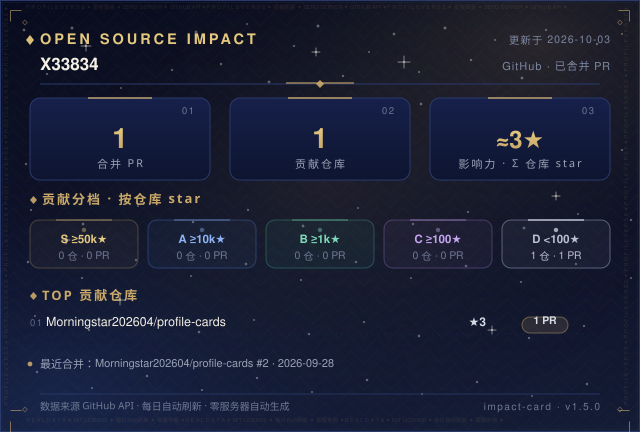
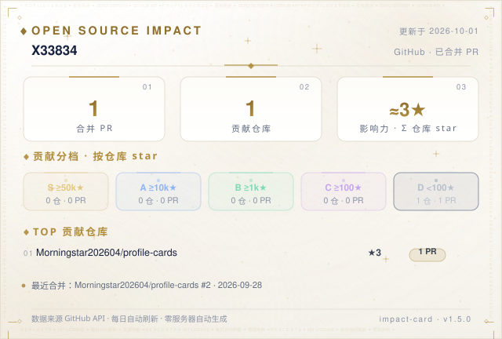

```yaml
- uses: X33834/profile-cards/components/impact-card@v1
  with:
    users: your-github-username      # multi-account: a,b
    output: impact-card.svg
```

### 2 · stats-card — Minimal stats
Followers / public repos / merged PRs riding a golden orbit. Big numbers, little noise.

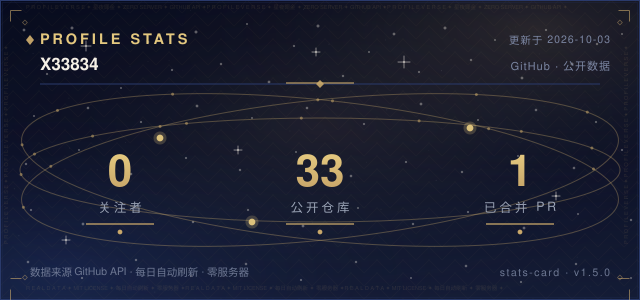
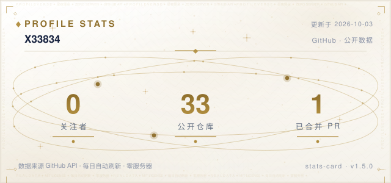

```yaml
- uses: X33834/profile-cards/components/stats-card@v1
  with:
    user: your-github-username
    output: stats-card.svg
```

### 3 · streak-card — Streak ring
Your current streak is the bright star at the center of a 60-tick dial. Real contribution calendar data.

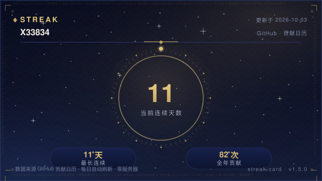
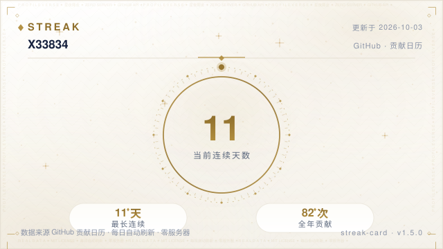

```yaml
- uses: X33834/profile-cards/components/streak-card@v1
  with:
    user: your-github-username
    output: streak-card.svg
```

### 4 · typing-card — Starry typewriter
Your tagline types itself out under the stars with a blinking gold cursor. Pure SVG + SMIL, no external service.


```yaml
- uses: X33834/profile-cards/components/typing-card@v1
  with:
    phrases: "First line;Second line;Third phrase"   # up to 3
    output: typing-card.svg
```

### 5 · contrib-grid-card — 3D contribution columns
An isometric golden contribution grid (light top / mid side / dark side), five gold tiers, 53 weeks. The "obviously different" card on your profile.

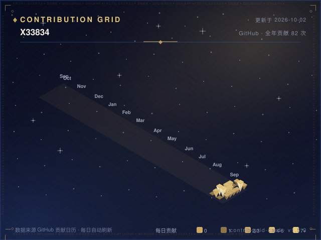
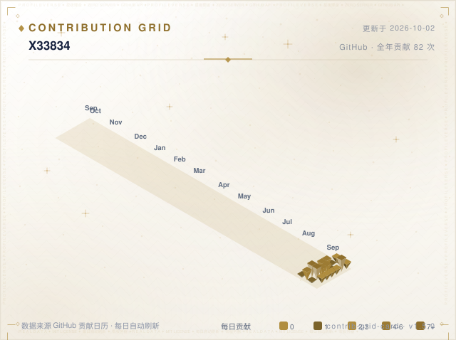

```yaml
- uses: X33834/profile-cards/components/contrib-grid-card@v1
  with:
    user: your-github-username
    output: contrib-grid-card.svg
```

> ✅ **Single entry**: the former standalone repo has been merged back here —
> this card lives only in the family, one repo, one `@v1`.

### 6 · tech-stack-card — Tech constellation
Your main language is the central star; others orbit on golden ellipses and connect into a constellation. Built from your real repo languages.

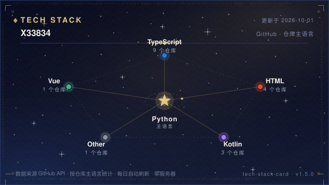
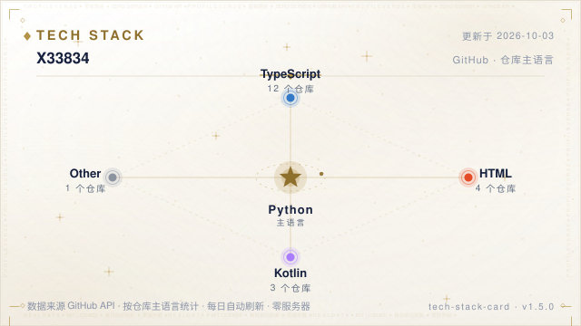

```yaml
- uses: X33834/profile-cards/components/tech-stack-card@v1
  with:
    user: your-github-username
    output: tech-stack-card.svg
```

### 7 · banner-card — Panorama header
Your glowing name, gradient text, comet trails. Pure visual, no API.

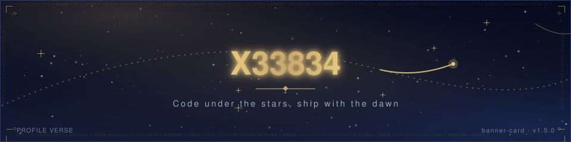
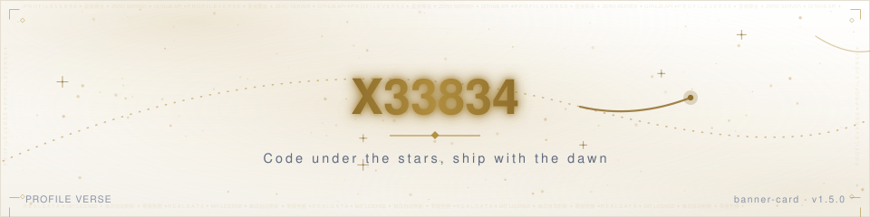

```yaml
- uses: X33834/profile-cards/components/banner-card@v1
  with:
    name: your-name
    output: banner-card.svg
```

### 8 · badge-card — Golden medals
A row of golden medal badges (gradient edge + star icon) instead of flat shields. Real data by default, fully customizable.

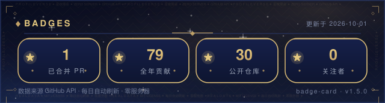
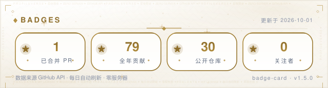

```yaml
- uses: X33834/profile-cards/components/badge-card@v1
  with:
    user: your-github-username
    output: badge-card.svg
    # badges: "PRs=12;Stars=256.9k;Repos=19"   # optional: fully custom
```

### 9 · year-review-card — Annual ring
Twelve months orbit a golden ring — the bigger and brighter the star, the more you contributed that month. Your year's total glows at the center, with four star-medals: peak month / longest streak / merged PRs / top language. Real 365-day contribution data.

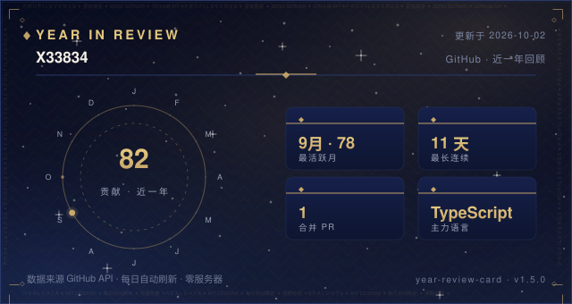
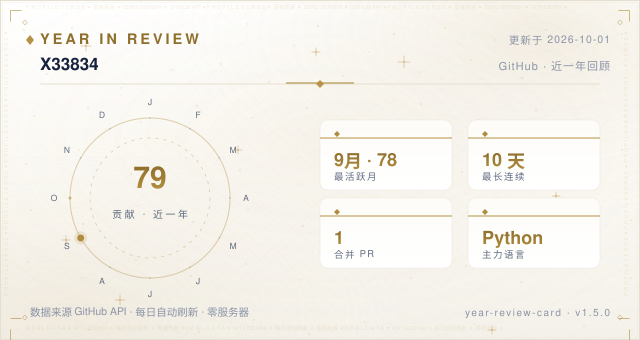

```yaml
- uses: X33834/profile-cards/components/year-review-card@v1
  with:
    user: your-github-username
    output: year-review-card.svg
```

### 10 · projects-card — Projects 2×2 grid
Your top non-fork repos by stars in a 2×2 grid — name · description · language · stars — replacing the flat text list. Live from the GitHub REST API, `count` up to 8.

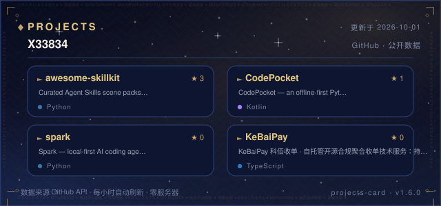
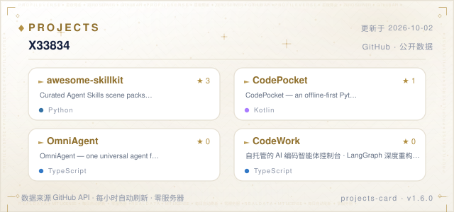

```yaml
- uses: X33834/profile-cards/components/projects-card@v1
  with:
    user: your-github-username
    output: projects-card.svg
```

## 🔄 Showcase: auto-refresh & theme switching

The family showcase (`assets/showcase/wall-*.png` and `assets/hero-*.png`) is
**rebuilt automatically every day at 01:00 UTC** by the
[`update.yml`](.github/workflows/update.yml) workflow — every number on every
card comes from the real GitHub API, and each card stamps its own update time,
so nothing in the picture ever goes stale.

- **Manual refresh / pick a theme**: go to **Actions → Refresh Preview Cards →
  Run workflow**, and set `theme` to `dark`, `light`, `rose`, `ocean`,
  `aurora`, `sunset`, `mint` — or `all` for every theme. The wall & hero are
  rebuilt in that theme with fresh data and pushed back.
- **Outputs**: `assets/showcase/wall-<theme>.png` (all 10 cards) and
  `assets/showcase/hero-<theme>.png` (banner + typing + hero row); the dark
  hero is also kept as `hero-home.png`.
- **Dark/light auto-switch**: this README's header uses a `<picture>` block,
  so visitors get the dark hero in dark mode and the light hero in light mode.
- **Show your own numbers — automatic**: `update.yml` reads
  `${{ github.repository_owner }}`, so when you fork this repo the daily
  refresh automatically shows **your** GitHub data — no edits needed.
  (The card components themselves also accept explicit `user` / `users`
  inputs if you ever want to point at someone else.)

## 🎨 Design system

- **One glance, one signature**: each card has one distinctive shape — star orbit / dial ring / typewriter / isometric 3D / constellation / comet banner / medals. No clone cards, no snake.
- **Starry night × gilded gold**: deep navy gradient sky + gold only on data (numbers, anchors, medals), muted gray-blue for body text — the numbers shine, not the decoration.
- **Seven themes, one input**: all palettes live in `core/theme.py` — `dark` (Midnight, default), `light` (Ivory), `rose` (Rose Gold), `ocean` (Deep Sea), `aurora` (Electric Violet), `sunset` (Coral Orange), `mint` (Fresh Jade).

| Theme | Name | Mood |
| --- | --- | --- |
| `dark` | Midnight | starry deep blue × gilded gold (default) |
| `light` | Ivory | paper white × embossed gold |
| `rose` | Rose Gold | warm ivory × rosy gilding |
| `ocean` | Deep Sea | cold navy-teal × moonlight silver-blue |
| `aurora` | Electric Violet | bright violet × electric violet gilding |
| `sunset` | Coral Orange | warm cream × coral gilding |
| `mint` | Fresh Jade | fresh jade × teal |

- **Postcard finishing**: every card carries a quiet letterpress edge signature — hairline marquees along the top/bottom and vertical monograms on the sides (`PROFILE VERSE ✦ ZERO SERVER ✦ …`), like printed stationery.
- **Real data**: everything goes through `core/github.py` — GitHub API / contribution calendar / star tiers. Cards are refreshed daily and stamp source + timestamp.
- **Room to breathe**: 640px-wide cards, big numbers, few words.

## 🧱 Repository layout

```
profile-cards/
├── core/                     shared core: GitHub API · contribution calendar · star tiers · themes
├── components/
│   ├── impact-card/          component = generator + template + action.yml + README + preview
│   ├── stats-card/
│   ├── streak-card/
│   ├── typing-card/
│   ├── contrib-grid-card/
│   ├── tech-stack-card/
│   ├── year-review-card/
│   ├── banner-card/
│   ├── badge-card/
│   └── projects-card/
├── examples/                 copy-paste workflows
├── .github/workflows/        daily preview refresh for this repo
└── README.md                 component catalog
```

## 🌱 One repo, one entry

All ten cards ship from this single repository — one `@v1`, one workflow,
zero servers. (A standalone copy of `contrib-grid-card` existed briefly and has
been merged back; if you bookmarked the old URL it now redirects here.)

A weekly **Stargazer Wall** issue thanks every new star automatically
(`.github/workflows/star-wall.yml`) — watch [issues](https://github.com/X33834/profile-cards/issues).

## 🤝 Contributing

New card ideas, theme refinements, bug reports — all welcome. See [CONTRIBUTING](CONTRIBUTING.md), and please follow the [Code of Conduct](CODE_OF_CONDUCT.md).

## 📜 License

MIT © X33834  ·  [VERSIONING](VERSIONING.md)  ·  [CHANGELOG](CHANGELOG.md)